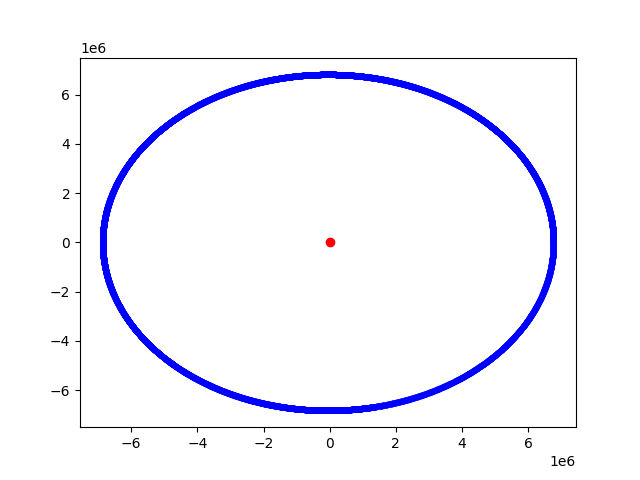

# orbital_sim
# Orbital Motion Simulation 🌍

This project simulates the motion of a satellite orbiting Earth using Python, based on Newton's law of gravitation.

## Overview
The simulation calculates the position and velocity of a satellite over time and visualizes its trajectory using Matplotlib.

## Technologies Used
- Python
- NumPy
- Matplotlib

## Concepts Used
- Newton’s Law of Gravitation
- Circular/Orbital Motion
- Numerical Integration (time-step simulation)

## How It Works
- The satellite is initialized at a certain height above Earth
- Gravitational force is calculated using:
  F = GM/r²
- Acceleration is applied to update velocity and position
- The orbit path is plotted in real time

## Output

## How to Run
1. Install required libraries:
   pip install numpy matplotlib

2. Run the script:
   python your_file_name.py

## Future Improvements
- Add elliptical orbits
- Improve visualization with Earth as a circle
- Add velocity variations to simulate different orbit types